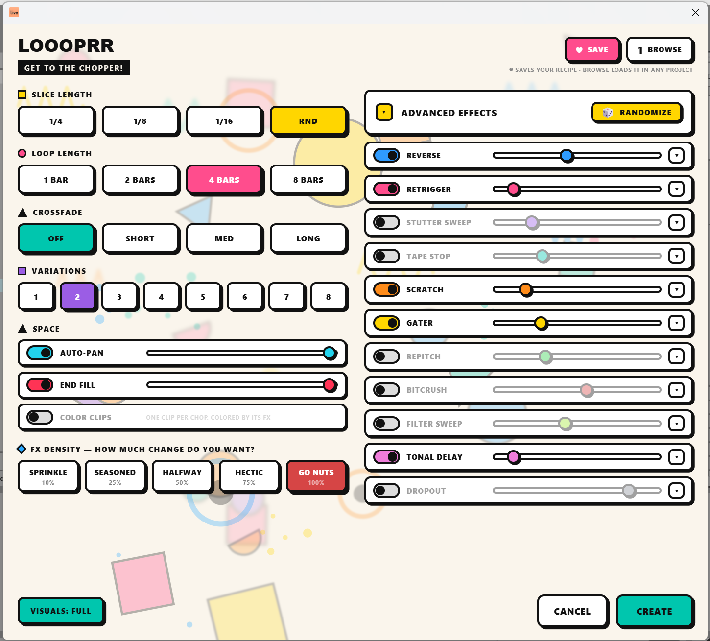
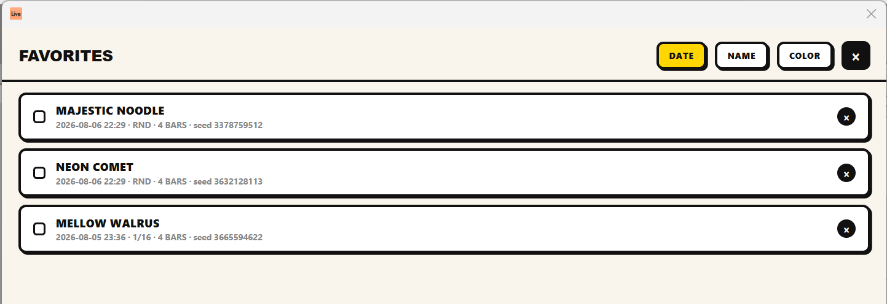

# LOOOPRR 🎲

### *GET TO THE CHOPPER!*

**Slice & shuffle the audio already in your Live Set into brand-new, tempo-synced glitch loops.**
An [Ableton Live 12 Extension](https://www.ableton.com/en/live/extensions) by **Paul Petrol**.




---

## What it does

Select a time range across one or more audio tracks in the Arrangement,
right-click → **Create Random Loop…**, hit **CREATE** — and Loooprr renders
your selection, chops it into **grid-locked slices**, shuffles them into new
loops, and drops them as warped, looping clips on a fresh track. Your source
audio is never touched, and everything is one Ctrl+Z away from gone.

The chops always land **on the grid** — slices are exact 1/4, 1/8 or 1/16
fractions of your selection, cut and placed on the beat — so the groove
survives the shuffle. This is a collage, not a blender.

## The FX

Every chop can get **one** effect, drawn from the rack:

| | | |
|---|---|---|
| 🔵 **Reverse** — full, half, or ping-pong | 🩷 **Retrigger** — stutter-repeat | 🟣 **Stutter sweep** — grid-locked repeats gliding in pitch |
| 🩵 **Tape stop** — fast / med / slow brake | 🟠 **Scratch** — vinyl scrub & spinback | 🟡 **Gater** — 2/3ᵀ/4/6ᵀ/8 gates, triplet feels |
| 🟢 **Repitch** — octave up or down | 🔴 **Bitcrush** — light to hard | 🍏 **Filter sweep** — gliding LP/HP with depth |
| 🎀 **Tonal delay** — pitched ring with motion LFO | ⚪ **Dropout** — holes: full, half, or fade | |

**FX DENSITY** is the one knob that rules them all — *how much change do you
want?* From **SPRINKLE** (10% of chops) to **GO NUTS** (every single one).
The weight sliders in the **EFFECTS** rack simply divide that budget
(they always sum to 100% — push one up and the others give way), so a loop
can mathematically never oversaturate. Feeling lucky? The 🎲 **RANDOMIZE**
rerolls the whole rack. Want none of it? Flip the EFFECTS master switch
off and Loooprr is a **pure chopper** — just slicing and rearranging.

On top: **AUTO-PAN** (alternating chops left/right), **END FILL** (the last
beat becomes an accelerating snare-roll), and **COLOR CLIPS** — place one
clip per chop, colored by the effect that hit it, so you can *see* your
loop's structure right in the Arrangement.

## Favorites

Dialed in something you love? **♥ SAVE** stores the whole recipe — every
setting *and* the exact shuffle — under a name like DISCO WALRUS or MAJESTIC
NOODLE. Load it in any other project and get the exact same chops on brand
new material. Sort by date, name or color tag; right-click to rename,
recolor or delete.



## Install

1. Download **`Loooprr-x.y.z.ablx`** from the [latest release](../../releases/latest).
2. Drag it into **Live → Settings → Extensions**.
3. Restart Live.
4. Select audio in the Arrangement → right-click → **Create Random Loop…**

Requires **Ableton Live 12 Suite Beta 12.4.5+** (Extensions don't exist in
the stable release yet).

## Build from source

The Ableton Extensions SDK may not be redistributed, so bring your own
tarballs from the Extensions beta and drop them in `./sdk/`:

```
sdk/ableton-extensions-sdk-1.0.0-beta.0.tgz
sdk/ableton-extensions-cli-1.0.0-beta.0.tgz
```

Then, with Node ≥ 24.14:

```bash
npm install        # resolves the SDK/CLI from ./sdk/*.tgz
npm test           # offline DSP unit tests (no Live needed)
npm run package    # type-check + bundle + .ablx
```

The DSP is pure, dependency-free TypeScript — fully deterministic (a saved
recipe always renders the same loops), unit-tested offline, output rendered
as 48 kHz / 24-bit WAV.

## Nice touches

- Every adjustment quietly deals a fresh shuffle, so each tweak is a
  genuinely new roll — while reopening the dialog keeps your last recipe,
  so the loop you just made can be reopened and ♥ saved exactly as it
  sounded.
- The chops never touch your source audio: results land on a new track,
  and one undo removes everything.
- The dialog sizes itself to your screen. Weak machine? **VISUALS: ECO**
  switches off the interface eye-candy.

## License

[MIT](LICENSE) © 2026 Paul Petrol. The Ableton Extensions SDK itself is
proprietary and not part of this repository.
